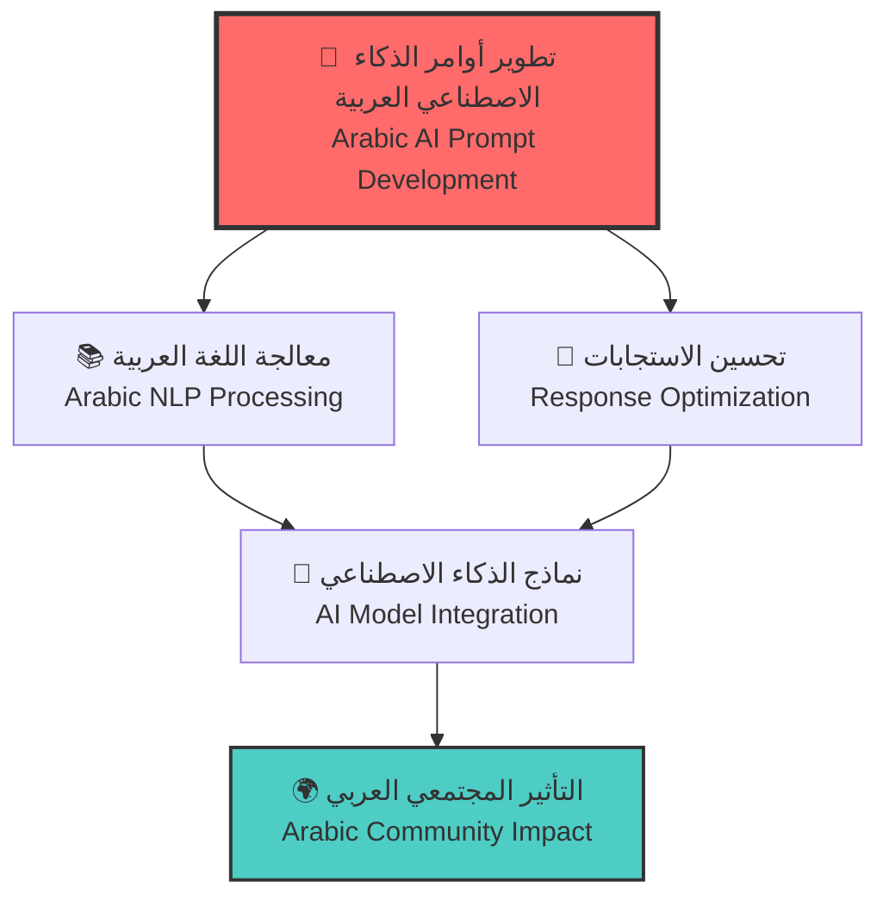
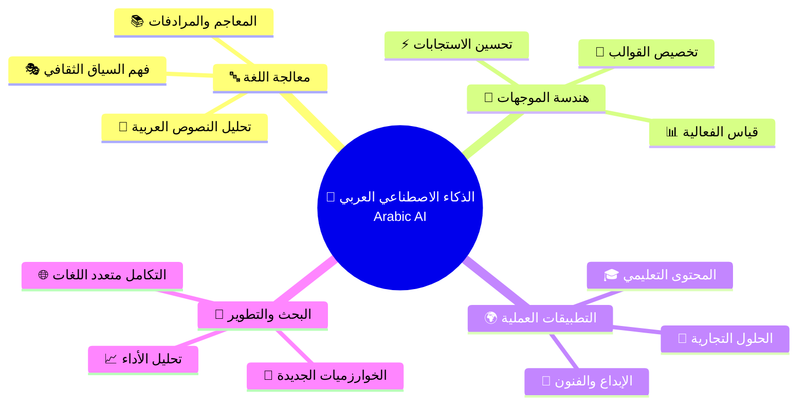

# 🚀 Marwan.dev

---

## 📚 Table of Contents | جدول المحتويات
- [🌟 Overview | نظرة عامة](#-overview--نظرة-عامة)
- [👨‍💻 About Me | نبذة عني](#-about-me--نبذة-عني)
- [🎯 Mission & Vision | المهمة والرؤية](#-mission--vision--المهمة-والرؤية)
- [📊 GitHub Analytics | إحصائيات GitHub](#-github-analytics--إحصائيات-github)
- [🎯 Current Focus | التركيز الحالي](#-current-focus--التركيز-الحالي)
- [🔬 Arabic Prompt Engineering Research | بحوث هندسة الموجهات العربية](#-arabic-prompt-engineering-research--بحوث-هندسة-الموجهات-العربية)
- [🔗 Connect With Me | تواصل معي](#-connect-with-me--تواصل-معي)
- [📄 License | الترخيص](#-license--الترخيص)

---

## 🌟 Overview | نظرة عامة

<table>
<tr>
<td>

### English
**Welcome to Marwan.dev** – Your gateway to advanced AI prompt engineering with a special focus on the richness and eloquence of the Arabic language. Here, innovation meets tradition, and cutting-edge AI technology embraces the depth of one of the world's most expressive languages.

</td>
<td>

### العربية
**مرحباً بكم في Marwan.dev** – بوابتكم إلى هندسة موجهات الذكاء الاصطناعي المتقدمة مع التركيز الخاص على ثراء وفصاحة اللغة العربية. هنا يلتقي الابتكار بالتراث، وتحتضن تقنيات الذكاء الاصطناعي المتطورة عمق إحدى أكثر لغات العالم تعبيراً.

</td>
</tr>
</table>

---

## 👨‍💻 About Me | نبذة عني

### English

Hi there! I'm **Marwan Abdalhafedh** 👋

🔹 **AI Prompt Engineer** passionate about bridging the gap between advanced AI technology and the Arabic language  
🔹 **Location:** 📍 Iraq 🇮🇶  
🔹 **Focus:** AI/ML, NLP, Prompt Engineering, Arabic Language Processing  
🔹 **Experience:** 1+ years in AI prompt optimization and language modeling  
🔹 **Languages:** Arabic (Native), English (Fluent)

### العربية

مرحباً! أنا **مروان عبد الحافظ** 👋

🔹 **مهندس موجهات ذكاء اصطناعي** متحمس لربط التقنيات المتقدمة باللغة العربية  
🔹 **الموقع:** 📍 العراق 🇮🇶  
🔹 **التخصص:** الذكاء الاصطناعي، معالجة اللغات الطبيعية، هندسة الموجهات العربية  
🔹 **الخبرة:** أكثر من سنة في تحسين موجهات الذكاء الاصطناعي ونمذجة اللغة  
🔹 **اللغات:** العربية (لغة أم)، الإنجليزية (بطلاقة)

---

## 🎯 Mission & Vision | المهمة والرؤية

<table>
<tr>
<td width="50%">

### Mission
> **"Elevate AI interactions through the power and elegance of the Arabic language"**

I design sophisticated prompts and frameworks that maximize AI performance across text, image, and video generation models. My mission is to:

- 🎯 Produce precise, reliable, and culturally resonant AI outputs
- 🌍 Bridge the gap between Arabic culture and modern AI technology  
- 📚 Democratize AI prompt engineering knowledge in Arabic
- 🚀 Push the boundaries of multilingual AI capabilities

</td>
<td width="50%">

### الرؤية
> **"الارتقاء بالتفاعل مع الذكاء الاصطناعي من خلال قوة وأناقة اللغة العربية"**

أصمم موجهات وأطر عمل متطورة تعظم أداء نماذج الذكاء الاصطناعي. رسالتي هي:

- 🎯 إنتاج مخرجات دقيقة وموثوقة وذات صدى ثقافي
- 🌍 ربط الثقافة العربية بتقنيات الذكاء الاصطناعي الحديثة
- 📚 نشر المعرفة في هندسة الموجهات باللغة العربية  
- 🚀 دفع حدود قدرات الذكاء الاصطناعي متعدد اللغات

</td>
</tr>
</table>

---

## 📊 GitHub Analytics | إحصائيات GitHub

<table>
<tr>
<td width="50%">

</td>
<td width="50%">

</td>
</tr>
</table>

---

## 🎯 Current Focus | التركيز الحالي

### 🔥 What I'm Working On | ما أعمل عليه حالياً

<table>
<tr>
<td width="50%">

**Current Projects:**
- 🔬 **Advanced Arabic Prompting**: Developing sophisticated prompt templates for Arabic AI models
- 📊 **Performance Metrics**: Creating evaluation frameworks for Arabic AI responses
- 🛠️ **Open Source Tools**: Building free prompt engineering libraries for Arabic developers
- 📚 **Educational Content**: Producing comprehensive Arabic AI learning materials
- 🌐 **Community Building**: Establishing the premier Arabic AI engineering hub

</td>
<td width="50%">

**المشاريع الحالية:**
- 🔬 **هندسة الموجهات العربية المتقدمة**: تطوير قوالب موجهات متطورة للذكاء الاصطناعي العربي
- 📊 **مقاييس الأداء**: إنشاء أطر تقييم لاستجابات الذكاء الاصطناعي العربية
- 🛠️ **أدوات مفتوحة المصدر**: بناء مكتبات مجانية لهندسة الموجهات للمطورين العرب
- 📚 **المحتوى التعليمي**: إنتاج مواد تعليمية شاملة للذكاء الاصطناعي العربي
- 🌐 **بناء المجتمع**: تأسيس المركز الرائد لهندسة الذكاء الاصطناعي العربي

</td>
</tr>
</table>

---

## 🔬 Arabic Prompt Engineering Research | بحوث هندسة الموجهات العربية

### 📊 خريطة البحث في الذكاء الاصطناعي العربي | Arabic AI Research Map

### 📋 مجالات التخصص الحالية | Current Research Areas

<table>
<tr>
<td width="25%" align="center">

**🔤 اللغويات الحاسوبية** 
*Computational Linguistics*
- قواعد النحو العربي
- الصرف والاشتقاق
- التراكيب اللغوية

</td>
<td width="25%" align="center">

**🎭 السياق الثقافي** 
*Cultural Context*
- التراث العربي
- القيم الاجتماعية
- الأدب والشعر

</td>
<td width="25%" align="center">

**⚡ تحسين الأداء** 
*Performance Optimization*
- سرعة الاستجابة
- دقة المخرجات
- كفاءة الموارد

</td>
<td width="25%" align="center">

**🌐 التطبيقات العملية** 
*Practical Applications*
- المساعدات الذكية
- الترجمة الآلية
- توليد المحتوى

</td>
</tr>
</table>

---

## 📄 License | الترخيص

**© 2025 Marwan Abdalhafedh | مروان عبد الحافظ**  
**Freelance AI Engineer | مهندس ذكاء اصطناعي مستقل**

---

### 🤝 Professional Services | الخدمات المهنية

<table>
<tr>
<td width="50%">

**Available for Hire:**
- 🤖 **AI Prompt Engineering**: Custom solutions for Arabic and multilingual AI models
- 🔬 **Research & Development**: Advanced AI research projects and prototyping  
- 🎓 **Training & Workshops**: Professional AI training programs in Arabic
- 📝 **Technical Writing**: AI documentation and educational content creation
- 🌐 **Consulting Services**: AI strategy and implementation guidance

</td>
<td width="50%">

**متاح للتوظيف:**
- 🤖 **هندسة موجهات الذكاء الاصطناعي**: حلول مخصصة للنماذج العربية ومتعددة اللغات
- 🔬 **البحث والتطوير**: مشاريع بحثية متقدمة وإنشاء نماذج أولية
- 🎓 **التدريب وورش العمل**: برامج تدريبية مهنية باللغة العربية
- 📝 **الكتابة التقنية**: توثيق الذكاء الاصطناعي وإنشاء المحتوى التعليمي
- 🌐 **الخدمات الاستشارية**: إرشادات استراتيجية وتنفيذ الذكاء الاصطناعي

</td>
</tr>
</table>

---

### 📋 Work Terms | شروط العمل

**🔸 Availability:** Open for freelance projects, consultations, and long-term collaborations  
**🔸 التوفر:** متاح للمشاريع المستقلة والاستشارات والتعاون طويل المدى

**🔸 Specialization:** Arabic AI, Prompt Engineering, Multilingual AI Models, Research & Development  
**🔸 التخصص:** الذكاء الاصطناعي العربي، هندسة الموجهات، النماذج متعددة اللغات، البحث والتطوير

**🔸 Languages:** Arabic, English  
**🔸 اللغات:** العربية، الإنجليزية

---

---

<i>✨ "مهندس ذكاء اصطناعي مستقل - متخصص في الحلول العربية المبتكرة" ✨</i> 
<i>✨ "Freelance AI Engineer - Specializing in Innovative Arabic Solutions" ✨</i>

