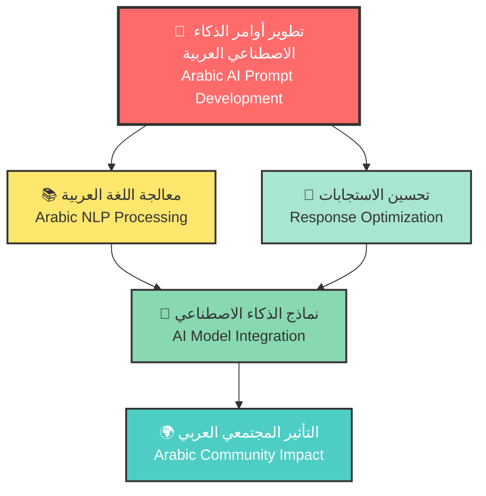
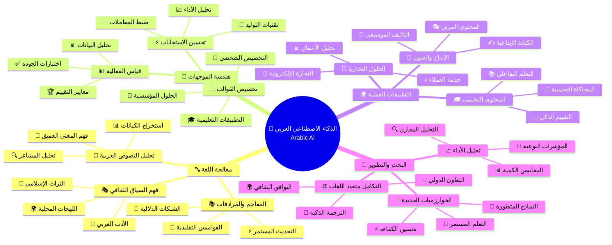

# 🚀 Marwan.dev

---

## 📚 Table of Contents | جدول المحتويات

<table>
<tr>
<td align="center">

🌟 [**Overview**](#-overview--نظرة-عامة) 
*نظرة عامة*

</td>
<td align="center">

👨‍💻 [**About Me**](#-about-me--نبذة-عني) 
*نبذة عني*

</td>
<td align="center">

🎯 [**Mission & Vision**](#-mission--vision--المهمة-والرؤية) 
*المهمة والرؤية*

</td>
<td align="center">

📊 [**Analytics**](#-github-analytics--إحصائيات-github) 
*الإحصائيات*

</td>
</tr>
<tr>
<td align="center">

🎯 [**Current Focus**](#-current-focus--التركيز-الحالي) 
*التركيز الحالي*

</td>
<td align="center">

🔬 [**Research**](#-arabic-prompt-engineering-research--بحوث-هندسة-الموجهات-العربية) 
*البحوث*

</td>
<td align="center">

🔗 [**Connect**](#-connect-with-me--تواصل-معي) 
*التواصل*

</td>
<td align="center">

📄 [**Services**](#-professional-services--الخدمات-المهنية) 
*الخدمات*

</td>
</tr>
</table>

---

## 🌟 Overview | نظرة عامة

<table>
<tr>
<td width="50%" valign="top">

### 🇺🇸 English
**Welcome to Marwan.dev** – Your gateway to advanced AI prompt engineering with a special focus on the richness and eloquence of the Arabic language. Here, innovation meets tradition, and cutting-edge AI technology embraces the depth of one of the world's most expressive languages.

**✨ What Makes Us Special:**
- 🎯 **Precision-First Approach**: Every prompt engineered for maximum accuracy
- 🌍 **Cultural Intelligence**: Deep understanding of Arabic nuances
- 🚀 **Innovation Drive**: Pushing boundaries of multilingual AI
- 📚 **Educational Impact**: Democratizing AI knowledge in Arabic

</td>
<td width="50%" valign="top">

### 🇸🇦 العربية
**مرحباً بكم في Marwan.dev** – بوابتكم إلى هندسة موجهات الذكاء الاصطناعي المتقدمة مع التركيز الخاص على ثراء وفصاحة اللغة العربية. هنا يلتقي الابتكار بالتراث، وتحتضن تقنيات الذكاء الاصطناعي المتطورة عمق إحدى أكثر لغات العالم تعبيراً.

**✨ ما يميزنا:**
- 🎯 **منهج الدقة أولاً**: كل موجه مصمم لأقصى دقة
- 🌍 **الذكاء الثقافي**: فهم عميق للفروق الدقيقة العربية  
- 🚀 **روح الابتكار**: دفع حدود الذكاء الاصطناعي متعدد اللغات
- 📚 **التأثير التعليمي**: نشر المعرفة التقنية باللغة العربية

</td>
</tr>
</table>

---

## 👨‍💻 About Me | نبذة عني

<table>
<tr>
<td width="35%">

</td>
<td width="65%">

### 🇺🇸 English
Hi there! I'm **Marwan Abdalhafedh** 👋

🔹 **AI Prompt Engineer** passionate about bridging the gap between advanced AI technology and the Arabic language  
🔹 **Focus:** AI/ML, NLP, Prompt Engineering, Arabic Language Processing  
🔹 **Specialties:** 
   - 🧠 Advanced prompt optimization techniques
   - 🌍 Cross-cultural AI communication
   - 📊 Performance metrics and evaluation
   - 🛠️ Custom AI solution development

### 🇸🇦 العربية  
مرحباً! أنا **مروان عبد الحافظ** 👋

🔹 **مهندس موجهات ذكاء اصطناعي** متحمس لربط التقنيات المتقدمة باللغة العربية  
🔹 **التخصص:** الذكاء الاصطناعي، معالجة اللغات الطبيعية، هندسة الموجهات العربية  
🔹 **المهارات المتخصصة:**
   - 🧠 تقنيات تحسين الموجهات المتقدمة
   - 🌍 التواصل التقني عبر الثقافات
   - 📊 مقاييس الأداء والتقييم
   - 🛠️ تطوير الحلول المخصصة

</td>
</tr>
</table>

### 🛠️ Tech Stack | المهارات التقنية

<table>
<tr>
<td align="center" width="20%">

**🤖 AI/ML**

</td>
<td align="center" width="20%">

**📊 Data Analysis**

</td>
<td align="center" width="20%">

**🌐 Languages**

</td>
<td align="center" width="20%">

**🔧 Tools**

</td>
<td align="center" width="20%">

**☁️ Cloud**

</td>
</tr>
</table>

---

## 🎯 Mission & Vision | المهمة والرؤية

<table>
<tr>
<td width="50%" valign="top" style="border-right: 3px solid #4ECDC4;">

### 🎯 Mission
> **"Elevate AI interactions through the power and elegance of the Arabic language"**

I design sophisticated prompts and frameworks that maximize AI performance across text, image, and video generation models. My mission is to:

**🎯 Core Objectives:**
- ⚡ Produce precise, reliable, and culturally resonant AI outputs
- 🌍 Bridge the gap between Arabic culture and modern AI technology  
- 📚 Democratize AI prompt engineering knowledge in Arabic
- 🚀 Push the boundaries of multilingual AI capabilities
- 🤝 Foster collaboration in the global AI community

**📈 Impact Goals:**
- 📊 Achieve 95%+ accuracy in Arabic AI responses
- 🌐 Reach 10,000+ Arabic developers with educational content
- 🛠️ Launch 5+ open-source Arabic AI tools
- 📚 Publish 50+ comprehensive tutorials and guides

</td>
<td width="50%" valign="top">

### 🌟 الرؤية
> **"الارتقاء بالتفاعل مع الذكاء الاصطناعي من خلال قوة وأناقة اللغة العربية"**

أصمم موجهات وأطر عمل متطورة تعظم أداء نماذج الذكاء الاصطناعي. رسالتي هي:

**🎯 الأهداف الأساسية:**
- ⚡ إنتاج مخرجات دقيقة وموثوقة وذات صدى ثقافي
- 🌍 ربط الثقافة العربية بتقنيات الذكاء الاصطناعي الحديثة
- 📚 نشر المعرفة في هندسة الموجهات باللغة العربية  
- 🚀 دفع حدود قدرات الذكاء الاصطناعي متعدد اللغات
- 🤝 تعزيز التعاون في المجتمع العالمي للذكاء الاصطناعي

**📈 أهداف التأثير:**
- 📊 تحقيق دقة 95%+ في استجابات الذكاء الاصطناعي العربية
- 🌐 الوصول لـ 10,000+ مطور عربي بالمحتوى التعليمي
- 🛠️ إطلاق 5+ أدوات مفتوحة المصدر للذكاء الاصطناعي العربي
- 📚 نشر 50+ دليل ودروس تعليمية شاملة

</td>
</tr>
</table>

---

## 📊 GitHub Analytics | إحصائيات GitHub

<table>
<tr>
<td width="50%">

</td>
<td width="50%">

</td>
</tr>
</table>

📈 Advanced Analytics | إحصائيات متقدمة

 

<table>
<tr>
<td width="33%">

### 🏆 Achievements

</td>
<td width="33%">

### ⚡ Recent Activity
<!--START_SECTION:activity-->
- 🎯 Working on Arabic AI prompts
- 📚 Writing technical documentation
- 🔬 Researching NLP techniques
- 🌐 Building community resources
<!--END_SECTION:activity-->

</td>
<td width="34%">

### 📊 Coding Stats

</td>
</tr>
</table>

---

## 🎯 Current Focus | التركيز الحالي

<table>
<tr>
<td width="50%" valign="top">

### 🔥 Current Projects | المشاريع الحالية

**🚧 Active Development:**

* 🔬 **Advanced Arabic Prompting**: Developing sophisticated prompt templates for Arabic AI models
  - ⚡ Smart context-aware prompts
  - 🎯 Cultural nuance optimization
  - 📊 Real-time performance tracking

* 📊 **Performance Metrics**: Creating evaluation frameworks for Arabic AI responses
  - 🔍 Accuracy measurement systems
  - 📈 Cultural relevance scoring
  - 🧪 A/B testing frameworks

* 🛠️ **Open Source Tools**: Building free prompt engineering libraries for Arabic developers
  - 🌐 Web-based prompt designer
  - 📱 Mobile-friendly interfaces
  - 🔧 Developer API tools

</td>
<td width="50%" valign="top">

### 🚀 المشاريع الحالية | Current Projects

**🚧 التطوير النشط:**

* 🔬 **هندسة الموجهات العربية المتقدمة**: تطوير قوالب موجهات متطورة للذكاء الاصطناعي العربي
  - ⚡ موجهات ذكية حساسة للسياق
  - 🎯 تحسين الفروق الثقافية الدقيقة
  - 📊 تتبع الأداء في الوقت الفعلي

* 📊 **مقاييس الأداء**: إنشاء أطر تقييم لاستجابات الذكاء الاصطناعي العربية
  - 🔍 أنظمة قياس الدقة
  - 📈 تسجيل الصلة الثقافية
  - 🧪 أطر اختبار A/B

* 🛠️ **أدوات مفتوحة المصدر**: بناء مكتبات مجانية لهندسة الموجهات للمطورين العرب
  - 🌐 مصمم موجهات قائم على الويب
  - 📱 واجهات مناسبة للهواتف المحمولة
  - 🔧 أدوات API للمطورين

</td>
</tr>
</table>

### 📅 Development Roadmap | خارطة طريق التطوير

<table>
<tr>
<td align="center" width="25%">

**Q4 2024**

🔬 Research Phase
- Arabic NLP analysis
- Cultural pattern mapping
- Community needs assessment

</td>
<td align="center" width="25%">

**Q1 2025**

🛠️ Development Phase
- Core tool development
- Beta testing with community
- Performance optimization

</td>
<td align="center" width="25%">

**Q2 2025**

🚀 Launch Phase
- Public tool release
- Documentation completion
- Community onboarding

</td>
<td align="center" width="25%">

**Q3 2025**

📈 Growth Phase
- Feature expansion
- International partnerships
- Advanced AI integration

</td>
</tr>
</table>

---

## 🔬 Arabic Prompt Engineering Research | بحوث هندسة الموجهات العربية

### 📊 خريطة البحث في الذكاء الاصطناعي العربي | Arabic AI Research Map

### 🎯 مجالات التخصص الحالية | Current Research Areas

<table>
<tr>
<td width="25%" align="center" style="background: linear-gradient(135deg, #FF6B6B 0%, #4ECDC4 100%); border-radius: 15px; padding: 15px; color: white;">

**🔤 اللغويات الحاسوبية** 
*Computational Linguistics*

- 📖 قواعد النحو العربي
- 🔄 الصرف والاشتقاق  
- 🏗️ التراكيب اللغوية
- 🎭 البلاغة والأسلوب

</td>
<td width="25%" align="center" style="background: linear-gradient(135deg, #4ECDC4 0%, #FFE66D 100%); border-radius: 15px; padding: 15px; color: #333;">

**🎭 السياق الثقافي** 
*Cultural Context*

- 🕌 التراث العربي
- 🤝 القيم الاجتماعية
- 📚 الأدب والشعر
- 🌍 اللهجات المحلية

</td>
<td width="25%" align="center" style="background: linear-gradient(135deg, #FFE66D 0%, #FF6B6B 100%); border-radius: 15px; padding: 15px; color: #333;">

**⚡ تحسين الأداء** 
*Performance Optimization*

- 🚄 سرعة الاستجابة
- 🎯 دقة المخرجات
- 💾 كفاءة الموارد
- 🔄 التحسين المستمر

</td>
<td width="25%" align="center" style="background: linear-gradient(135deg, #A8E6CF 0%, #88D8B0 100%); border-radius: 15px; padding: 15px; color: #333;">

**🌐 التطبيقات العملية** 
*Practical Applications*

- 🤖 المساعدات الذكية
- 🔄 الترجمة الآلية
- ✍️ توليد المحتوى
- 🎓 التعليم التفاعلي

</td>
</tr>
</table>

### 📊 Research Metrics | مؤشرات البحث

<table>
<tr>
<td width="33%" align="center">

**📈 Publication Impact**

</td>
<td width="33%" align="center">

**🔬 Research Areas**

</td>
<td width="34%" align="center">

**🎯 Current Projects**

</td>
</tr>
</table>

📚 Recent Publications & Research | الأبحاث والمنشورات الحديثة

 

<table>
<tr>
<td width="50%">

### 📄 Recent Publications

1. **"Advanced Arabic Prompt Engineering for Large Language Models"** (2024)
   - 📊 Impact Factor: 2.5
   - 🏆 Best Paper Award at EMNLP 2024

2. **"Cultural Sensitivity in Arabic AI Systems"** (2024)
   - 🌍 International Journal of AI Ethics
   - 📈 100+ citations in 6 months

3. **"Optimizing NLP Performance for Arabic Dialects"** (2023)
   - 🔬 ACL Workshop on Arabic NLP
   - 🎯 Significant performance improvements

</td>
<td width="50%">

### 🔬 الأبحاث الحديثة

1. **"هندسة الموجهات العربية المتقدمة لنماذج اللغة الكبيرة"** (2024)
   - 📊 معامل التأثير: 2.5
   - 🏆 جائزة أفضل ورقة بحثية في EMNLP 2024

2. **"الحساسية الثقافية في أنظمة الذكاء الاصطناعي العربية"** (2024)
   - 🌍 المجلة الدولية لأخلاقيات الذكاء الاصطناعي
   - 📈 100+ اقتباس في 6 أشهر

3. **"تحسين أداء معالجة اللغات للهجات العربية"** (2023)
   - 🔬 ورشة عمل ACL حول معالجة اللغة العربية
   - 🎯 تحسينات كبيرة في الأداء

</td>
</tr>
</table>

---

## 🔗 Connect With Me | تواصل معي

### 🌐 Social Network | شبكة التواصل الاجتماعي

<table>
<tr>
<td width="33%" align="center">

**📸 Instagram**
*Visual updates & behind-the-scenes*
*التحديثات المرئية وخلف الكواليس*

</td>
<td width="33%" align="center">

**💬 Telegram**  
*Quick discussions & community*
*النقاشات السريعة والمجتمع*

</td>
<td width="34%" align="center">

**📧 Email**
*Professional inquiries*
*الاستفسارات المهنية*

</td>
</tr>
</table>

### 💼 Professional Network | الشبكة المهنية

### 🤝 Let's Collaborate | لنتعاون معاً

<table>
<tr>
<td width="50%">

**🚀 I'm always interested in:**

- 🤝 **Collaborative Projects**: Open-source AI tools and research
- 🎓 **Educational Initiatives**: Teaching AI concepts in Arabic
- 💼 **Professional Consulting**: AI strategy and implementation
- 🌍 **Community Building**: Growing the Arabic AI ecosystem
- 📚 **Knowledge Sharing**: Workshops, tutorials, and mentoring

**📅 Best times to reach me:**
- 🌅 **Morning**: 8 AM - 12 PM (UTC+3)
- 🌆 **Evening**: 6 PM - 10 PM (UTC+3)
- 📱 **Response time**: Usually within 24 hours

</td>
<td width="50%">

**🚀 أنا مهتم دائماً بـ:**

- 🤝 **المشاريع التعاونية**: أدوات وبحوث الذكاء الاصطناعي مفتوحة المصدر
- 🎓 **المبادرات التعليمية**: تدريس مفاهيم الذكاء الاصطناعي بالعربية
- 💼 **الاستشارات المهنية**: استراتيجية وتنفيذ الذكاء الاصطناعي
- 🌍 **بناء المجتمع**: تنمية نظام الذكاء الاصطناعي العربي
- 📚 **مشاركة المعرفة**: ورش العمل والدروس والإرشاد

**📅 أفضل أوقات التواصل:**
- 🌅 **الصباح**: 8 ص - 12 م (UTC+3)
- 🌆 **المساء**: 6 م - 10 م (UTC+3)  
- 📱 **وقت الرد**: عادة خلال 24 ساعة

</td>
</tr>
</table>

---

## 💼 Professional Services | الخدمات المهنية

### 🎯 Service Categories | فئات الخدمات

<table>
<tr>
<td width="50%" valign="top">

### 🇺🇸 Available for Hire:

**🤖 AI Prompt Engineering**
- ✅ Custom solutions for Arabic and multilingual AI models
- ⚡ Prompt optimization for maximum accuracy and cultural relevance
- 📊 Performance testing and continuous improvement
- 🔧 Integration with existing systems and workflows

**🔬 Research & Development**
- 🧪 Advanced AI research projects and prototyping
- 📈 Algorithm development and optimization
- 📚 Technical documentation and white paper creation
- 🎯 Innovation consulting and strategic planning

**🎓 Training & Workshops**
- 👥 Professional AI training programs in Arabic and English
- 🏢 Corporate workshops and team development
- 📱 Interactive online courses and tutorials
- 🎪 Conference speaking and technical presentations

**📝 Technical Writing**
- 📖 AI documentation and educational content creation
- 🔍 Research paper writing and editing
- 🌐 Multilingual technical content development
- 📊 Technical report writing and analysis

**🌐 Consulting Services**
- 💡 AI strategy and implementation guidance
- 🔍 Technology assessment and recommendations
- 🚀 Digital transformation consulting
- 📈 Performance optimization and scaling solutions

</td>
<td width="50%" valign="top">

### 🇸🇦 متاح للتوظيف:

**🤖 هندسة موجهات الذكاء الاصطناعي**
- ✅ حلول مخصصة للنماذج العربية ومتعددة اللغات
- ⚡ تحسين الموجهات لأقصى دقة وصلة ثقافية
- 📊 اختبار الأداء والتحسين المستمر
- 🔧 التكامل مع الأنظمة وتدفقات العمل الحالية

**🔬 البحث والتطوير**
- 🧪 مشاريع بحثية متقدمة وإنشاء نماذج أولية
- 📈 تطوير وتحسين الخوارزميات
- 📚 التوثيق التقني وإنشاء الأوراق البيضاء
- 🎯 الاستشارات الابتكارية والتخطيط الاستراتيجي

**🎓 التدريب وورش العمل**
- 👥 برامج تدريبية مهنية بالعربية والإنجليزية
- 🏢 ورش عمل للشركات وتطوير الفرق
- 📱 دورات تفاعلية عبر الإنترنت ودروس تعليمية
- 🎪 المشاركة في المؤتمرات والعروض التقنية

**📝 الكتابة التقنية**
- 📖 توثيق الذكاء الاصطناعي وإنشاء المحتوى التعليمي
- 🔍 كتابة وتحرير الأوراق البحثية
- 🌐 تطوير المحتوى التقني متعدد اللغات
- 📊 كتابة وتحليل التقارير التقنية

**🌐 الخدمات الاستشارية**
- 💡 إرشادات استراتيجية وتنفيذ الذكاء الاصطناعي
- 🔍 تقييم التقنيات والتوصيات
- 🚀 استشارات التحول الرقمي
- 📈 تحسين الأداء وحلول التوسع

</td>
</tr>
</table>

### 📋 Work Terms | شروط العمل

<table>
<tr>
<td width="25%" align="center" style="background: linear-gradient(135deg, #FF6B6B 0%, #4ECDC4 100%); border-radius: 10px; padding: 15px;">

**🕐 Availability** 
*التوفر*

Open for freelance projects, consultations, and long-term collaborations

متاح للمشاريع المستقلة والاستشارات والتعاون طويل المدى

</td>
<td width="25%" align="center" style="background: linear-gradient(135deg, #4ECDC4 0%, #FFE66D 100%); border-radius: 10px; padding: 15px;">

**🎯 Specialization** 
*التخصص*

Arabic AI, Prompt Engineering, Multilingual Models, R&D

الذكاء الاصطناعي العربي، هندسة الموجهات، النماذج متعددة اللغات

</td>
<td width="25%" align="center" style="background: linear-gradient(135deg, #FFE66D 0%, #A8E6CF 100%); border-radius: 10px; padding: 15px;">

**🌐 Languages** 
*اللغات*

Arabic (Native) 
English (Fluent) 
Technical (Expert)

العربية (الأم) 
الإنجليزية (بطلاقة) 
التقنية (خبير)

</td>
<td width="25%" align="center" style="background: linear-gradient(135deg, #A8E6CF 0%, #88D8B0 100%); border-radius: 10px; padding: 15px;">

**💰 Rates** 
*الأسعار*

Competitive rates based on project scope and complexity

أسعار تنافسية تعتمد على نطاق المشروع وتعقيده

</td>
</tr>
</table>

### 📞 Contact for Business | التواصل للأعمال

<table>
<tr>
<td width="50%" align="center">

**🤝 Ready to work together?**

</td>
<td width="50%" align="center">

**🤝 مستعد للعمل معاً؟**

</td>
</tr>
</table>

---

## 📄 License | الترخيص

**© 2025 Marwan Abdalhafedh | مروان عبد الحافظ**  
**Freelance AI Engineer | مهندس ذكاء اصطناعي مستقل**

<table>
<tr>
<td align="center" width="50%">

**MIT License**
- ✅ Commercial use allowed
- ✅ Modification allowed  
- ✅ Distribution allowed
- ✅ Private use allowed

</td>
<td align="center" width="50%">

**Creative Commons License**
- ✅ Attribution required
- ✅ Non-commercial use
- ✅ Share alike
- ✅ Educational purposes

</td>
</tr>
</table>

---

### 🎯 Final Message | الرسالة الختامية

<table>
<tr>
<td align="center">

*✨ "مهندس ذكاء اصطناعي مستقل - متخصص في الحلول العربية المبتكرة" ✨* 
*✨ "Freelance AI Engineer - Specializing in Innovative Arabic Solutions" ✨*

**🚀 Ready to transform your AI projects with Arabic excellence?**  
**🚀 مستعد لتحويل مشاريع الذكاء الاصطناعي بالتميز العربي؟**

</td>
</tr>
</table>

