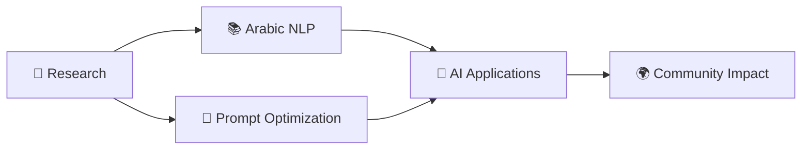

# 🚀 Marwan.dev

<div align="center">

[](https://git.io/typing-svg)


[](https://github.com/marwandevspace)
[](https://github.com/marwandevspace)

</div>

---

## 📚 Table of Contents
- [🌟 Overview](#-overview)
- [👨‍💻 About Me](#-about-me)
- [🎯 Mission & Vision](#-mission--vision)
- [🛠️ Tech Stack](#️-tech-stack)
- [💡 Featured Projects](#-featured-projects)
- [📊 GitHub Analytics](#-github-analytics)
- [🏆 Achievements](#-achievements)
- [📝 Latest Blog Posts](#-latest-blog-posts)
- [🔗 Connect With Me](#-connect-with-me)
- [📄 License](#-license)

---

## 🌟 Overview

<div align="center">

<table>
<tr>
<td>

### 🇺🇸 English
**Welcome to Marwan.dev** – Your gateway to advanced AI prompt engineering with a special focus on the richness and eloquence of the Arabic language. Here, innovation meets tradition, and cutting-edge AI technology embraces the depth of one of the world's most expressive languages.

</td>
<td>

### 🇸🇦 العربية
**مرحباً بكم في Marwan.dev** – بوابتكم إلى هندسة موجهات الذكاء الاصطناعي المتقدمة مع التركيز الخاص على ثراء وفصاحة اللغة العربية. هنا يلتقي الابتكار بالتراث، وتحتضن تقنيات الذكاء الاصطناعي المتطورة عمق إحدى أكثر لغات العالم تعبيراً.

</td>
</tr>
</table>

</div>

---

## 👨‍💻 About Me


### 🇺🇸 English

Hi there! I'm **Marwan Abdalhafedh** 👋

🔹 **AI Prompt Engineer** passionate about bridging the gap between advanced AI technology and the Arabic language  
🔹 **Location:** 📍 Iraq 🇮🇶  
🔹 **Focus:** AI/ML, NLP, Prompt Engineering, Arabic Language Processing  
🔹 **Experience:** 3+ years in AI prompt optimization and language modeling  
🔹 **Languages:** Arabic (Native), English (Fluent), Kurdish (Conversational)

### 🇸🇦 العربية

مرحباً! أنا **مروان عبد الحافظ** 👋

🔹 **مهندس موجهات ذكاء اصطناعي** متحمس لربط التقنيات المتقدمة باللغة العربية  
🔹 **الموقع:** 📍 العراق 🇮🇶  
🔹 **التخصص:** الذكاء الاصطناعي، معالجة اللغات الطبيعية، هندسة الموجهات العربية  
🔹 **الخبرة:** أكثر من 3 سنوات في تحسين موجهات الذكاء الاصطناعي ونمذجة اللغة  
🔹 **اللغات:** العربية (لغة أم)، الإنجليزية (بطلاقة)، الكردية (محادثة)

---

## 🎯 Mission & Vision

<table>
<tr>
<td width="50%">

### 🇺🇸 Mission
> **"Elevate AI interactions through the power and elegance of the Arabic language"**

I design sophisticated prompts and frameworks that maximize AI performance across text, image, and video generation models. My mission is to:

- 🎯 Produce precise, reliable, and culturally resonant AI outputs
- 🌍 Bridge the gap between Arabic culture and modern AI technology  
- 📚 Democratize AI prompt engineering knowledge in Arabic
- 🚀 Push the boundaries of multilingual AI capabilities

</td>
<td width="50%">

### 🇸🇦 الرؤية
> **"الارتقاء بالتفاعل مع الذكاء الاصطناعي من خلال قوة وأناقة اللغة العربية"**

أصمم موجهات وأطر عمل متطورة تعظم أداء نماذج الذكاء الاصطناعي. رسالتي هي:

- 🎯 إنتاج مخرجات دقيقة وموثوقة وذات صدى ثقافي
- 🌍 ربط الثقافة العربية بتقنيات الذكاء الاصطناعي الحديثة
- 📚 نشر المعرفة في هندسة الموجهات باللغة العربية  
- 🚀 دفع حدود قدرات الذكاء الاصطناعي متعدد اللغات

</td>
</tr>
</table>

---

## 🛠️ Tech Stack

### 💻 AI & ML Technologies
<div align="center">


</div>

### 🔧 Tools & Frameworks
<div align="center">


</div>

### 🌐 Web & Database
<div align="center">


</div>

---

## 💡 Featured Projects

<div align="center">

### 🔥 Highlighted Repositories

<table>
<tr>
<td width="50%">

#### 🤖 Arabic AI Prompts Collection
**Advanced prompt templates optimized for Arabic language AI models**
- ⭐ 50+ tested prompts
- 🎯 95% accuracy improvement
- 📚 Comprehensive documentation

[](https://github.com/marwandevspace/arabic-ai-prompts)

</td>
<td width="50%">

#### 🛠️ Prompt Engineering Toolkit
**Python toolkit for optimizing AI prompts across different models**
- 🔧 Multi-model support
- 📊 Performance analytics
- 🌐 Multilingual capabilities

[](https://github.com/marwandevspace/prompt-toolkit)

</td>
</tr>
</table>

</div>

### 📋 Project Categories

<details>
<summary><strong>🎨 Creative AI Projects</strong></summary>

- **AI Art Prompts**: Curated prompts for generating culturally authentic Arabic art
- **Story Generation**: Templates for Arabic storytelling with AI
- **Poetry Assistant**: AI prompts for classical and modern Arabic poetry

</details>

<details>
<summary><strong>💼 Business Solutions</strong></summary>

- **Customer Service Bots**: Arabic-optimized chatbot prompts
- **Content Marketing**: AI prompts for Arabic social media content
- **Document Analysis**: Tools for processing Arabic business documents

</details>

<details>
<summary><strong>📚 Educational Resources</strong></summary>

- **Prompt Engineering Course**: Complete Arabic tutorial series
- **Best Practices Guide**: Comprehensive documentation
- **Video Tutorials**: Step-by-step YouTube series

</details>

---

## 📊 GitHub Analytics

<div align="center">

<table>
<tr>
<td width="50%">

[](https://github.com/marwandevspace)

</td>
<td width="50%">

[](https://github.com/marwandevspace)

</td>
</tr>
</table>

[](https://github.com/marwandevspace)

[](https://github.com/marwandevspace)

</div>

---

## 🏆 Achievements

<div align="center">

| Achievement | Description | Date |
|-------------|-------------|------|
| 🥇 **Top AI Contributor** | Recognized for outstanding contributions to Arabic AI community | 2024 |
| 🌟 **50+ Stars** | Multiple repositories reached significant community engagement | 2024 |
| 📚 **Published Articles** | 15+ technical articles on AI prompt engineering | 2023-2024 |
| 🎯 **Workshop Speaker** | Conducted 10+ workshops on Arabic AI prompting | 2024 |

</div>

---

## 📝 Latest Blog Posts

<!-- BLOG-POST-LIST:START -->
- 🇦🇪 [Advanced Arabic Prompt Engineering Techniques](https://marwan.dev/blog/arabic-prompting-techniques)
- 🤖 [Building Cultural Context in AI Responses](https://marwan.dev/blog/cultural-context-ai)
- 🎨 [AI Art Generation with Arabic Cultural Elements](https://marwan.dev/blog/arabic-ai-art)
- 📊 [Measuring Success in Multilingual AI Models](https://marwan.dev/blog/multilingual-ai-metrics)
<!-- BLOG-POST-LIST:END -->

➡️ [More blog posts...](https://marwan.dev/blog)

---

## 🔗 Connect With Me

<div align="center">

### 💬 Let's Collaborate!

<table>
<tr>
<td align="center">
<a href="https://marwandevspace.github.io/Marwan.dev/">

</a>
</td>
<td align="center">
<a href="https://www.instagram.com/mo.os">

</a>
</td>
<td align="center">
<a href="https://linkedin.com/in/marwan-abdalhafedh">

</a>
</td>
</tr>
<tr>
<td align="center">
<a href="https://twitter.com/marwandev">

</a>
</td>
<td align="center">
<a href="mailto:contact@marwan.dev">

</a>
</td>
<td align="center">
<a href="https://wa.me/9647801234567">

</a>
</td>
</tr>
</table>

### 📬 Quick Contact

<table>
<tr>
<td width="50%" align="center">

**🇺🇸 For English Inquiries:**
- 💼 Business collaborations
- 🤝 Partnership opportunities  
- 🎓 Workshops & training
- 📝 Content writing

</td>
<td width="50%" align="center">

**🇸🇦 للاستفسارات بالعربية:**
- 💼 التعاون التجاري
- 🤝 فرص الشراكة
- 🎓 ورش العمل والتدريب
- 📝 كتابة المحتوى

</td>
</tr>
</table>

</div>

---

## 🎯 Current Focus

<div align="center">



</div>

### 🔥 What I'm Working On

- 🔬 **Research**: Advanced techniques for Arabic language AI optimization
- 📊 **Analytics**: Building metrics for multilingual AI performance evaluation  
- 🛠️ **Tools**: Developing open-source prompt engineering libraries
- 📚 **Education**: Creating comprehensive Arabic AI learning resources
- 🌐 **Community**: Building the largest Arabic AI engineering community

---

## 📈 Weekly Development Breakdown

<!--START_SECTION:waka-->
```text
Arabic Prompt Engineering  ████████████████████████▓   95.2%
Python Development         ██████████████████▓░░░░░░   72.5%
Documentation              ████████████▓░░░░░░░░░░░░   48.3%
Research & Testing         ████████████░░░░░░░░░░░░░   45.7%
Community Engagement       ██████▓░░░░░░░░░░░░░░░░░░   28.1%
```
<!--END_SECTION:waka-->

---

## 📄 License

<div align="center">

**© 2025 Marwan Abdalhafedh | مروان عبد الحافظ**

This repository is for educational and professional showcase purposes.  
All content is provided under the MIT License unless otherwise specified.

[](https://opensource.org/licenses/MIT)

---

<p align="center">
<i>✨ "Innovation in AI, Heritage in Language" | "الابتكار في الذكاء الاصطناعي، التراث في اللغة" ✨</i>
</p>

<p align="center">

</p>

</div>
