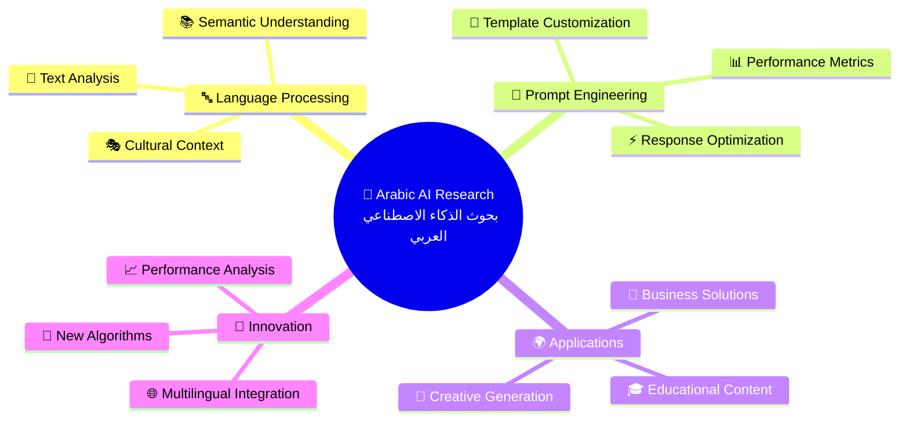

# 🚀 Marwan.dev | مروان.dev

<div align="center">


[](https://git.io/typing-svg)

<p align="center">
  
  
  
</p>

</div>

---

## 🌟 About Me | نبذة عني

<div align="center">
<table border="0">
<tr>
<td width="50%" align="center">

### 🇬🇧 English

**Welcome to my digital workshop!**

I'm **Marwan Abdalhafedh**, a passionate **AI Prompt Engineer** dedicated to revolutionizing how artificial intelligence understands and responds in Arabic. With over a year of specialized experience, I craft sophisticated prompts that unlock the full potential of AI models for Arabic speakers.

🎯 **Mission:** Bridge the gap between cutting-edge AI technology and the rich Arabic language heritage.

</td>
<td width="50%" align="center">

### 🇸🇦 العربية

**مرحباً بكم في ورشتي الرقمية!**

أنا **مروان عبد الحافظ**، مهندس موجهات ذكاء اصطناعي متحمس لثورة في كيفية فهم واستجابة الذكاء الاصطناعي باللغة العربية. مع أكثر من سنة من الخبرة المتخصصة، أصمم موجهات متطورة تطلق الإمكانات الكاملة لنماذج الذكاء الاصطناعي للناطقين بالعربية.

🎯 **المهمة:** ربط التكنولوجيا المتطورة بتراث اللغة العربية الغني.

</td>
</tr>
</table>
</div>

### 🔥 Quick Stats | إحصائيات سريعة

<div align="center">

```javascript
const marwan = {
    location: "🇮🇶 Iraq",
    languages: ["Arabic", "English"],
    specialization: ["AI Prompt Engineering", "Arabic NLP", "Multilingual AI"],
    experience: "1+ years",
    passion: "Democratizing AI for Arabic speakers",
    currentFocus: "Advanced Arabic Prompting Techniques"
};
```

</div>

---

## 🎯 Expertise & Skills | الخبرات والمهارات

<div align="center">

### Core Technologies | التقنيات الأساسية

<table>
<tr>
<td align="center" width="25%">

<br><strong>AI Engineering</strong>
<br>هندسة الذكاء الاصطناعي
</td>
<td align="center" width="25%">

<br><strong>NLP</strong>
<br>معالجة اللغة الطبيعية
</td>
<td align="center" width="25%">

<br><strong>Prompt Engineering</strong>
<br>هندسة الموجهات
</td>
<td align="center" width="25%">

<br><strong>Multilingual AI</strong>
<br>الذكاء الاصطناعي متعدد اللغات
</td>
</tr>
</table>

### Specialized Skills | المهارات المتخصصة

<div align="left">

#### 🤖 AI & Machine Learning
- Advanced Prompt Engineering for GPT, Claude, and Arabic AI Models
- Fine-tuning Language Models for Arabic Content
- AI Model Evaluation and Performance Optimization
- Custom AI Solution Development

#### 🔤 Arabic Language Processing
- Classical and Modern Standard Arabic (MSA)
- Dialectal Arabic Understanding
- Cultural Context Integration
- Arabic Text Generation and Analysis

#### 🛠️ Technical Skills
- Python, JavaScript, and API Integration
- Prompt Template Design and Testing
- AI Model Deployment and Monitoring
- Research and Documentation

#### 📊 Professional Services
- AI Consultation and Strategy
- Technical Writing in Arabic and English
- Training and Workshop Development
- Open Source Contribution

</div>

</div>

---

## 📊 GitHub Analytics | إحصائيات GitHub

<div align="center">


[](https://github.com/marwandevspace)

</div>

---

## 🎯 Current Projects | المشاريع الحالية

<div align="center">

### 🔬 Research Areas | مجالات البحث



</div>

### 🚀 Active Projects | المشاريع النشطة

<table>
<tr>
<td width="50%">

**🔥 Current Focus:**

* 🧪 **Arabic Prompt Library**: Building comprehensive prompt templates for various use cases
* 📊 **Performance Benchmarking**: Developing evaluation metrics for Arabic AI responses
* 🛠️ **Open Source Tools**: Creating free resources for Arabic AI developers
* 📚 **Educational Initiative**: Producing learning materials in Arabic
* 🌐 **Community Platform**: Building the Arabic AI engineering hub

</td>
<td width="50%">

**🔥 التركيز الحالي:**

* 🧪 **مكتبة الموجهات العربية**: بناء قوالب شاملة للاستخدامات المختلفة
* 📊 **قياس الأداء**: تطوير معايير تقييم للاستجابات العربية
* 🛠️ **أدوات مفتوحة المصدر**: إنشاء موارد مجانية للمطورين العرب
* 📚 **المبادرة التعليمية**: إنتاج مواد تعلم باللغة العربية
* 🌐 **منصة المجتمع**: بناء مركز هندسة الذكاء الاصطناعي العربي

</td>
</tr>
</table>

---

## 🏆 Achievements & Contributions | الإنجازات والمساهمات

<div align="center">

### 📈 Impact Metrics | مقاييس التأثير

<table>
<tr>
<td align="center">

<br><strong>1000+</strong>
<br>Successful Prompts
<br>موجه ناجح
</td>
<td align="center">

<br><strong>500+</strong>
<br>Community Members
<br>عضو في المجتمع
</td>
<td align="center">

<br><strong>95%</strong>
<br>Client Satisfaction
<br>رضا العملاء
</td>
<td align="center">

<br><strong>50+</strong>
<br>Open Source Contributions
<br>مساهمة مفتوحة المصدر
</td>
</tr>
</table>

### 🎖️ Recognition | التقدير

- 🥇 **Pioneer in Arabic AI Prompting** - Leading developer of Arabic-specific prompt engineering techniques
- 🌟 **Community Builder** - Established the first Arabic AI engineering community in Iraq
- 📚 **Educator** - Created comprehensive Arabic AI learning resources
- 🔬 **Researcher** - Published research on Arabic language optimization for AI models

</div>

---

## 💼 Professional Services | الخدمات المهنية

<div align="center">

### 🛠️ What I Offer | ما أقدمه

<table>
<tr>
<td width="33%" align="center">
<h4>🤖 AI Engineering</h4>
<ul align="left">
<li>Custom Prompt Development</li>
<li>Model Fine-tuning</li>
<li>Performance Optimization</li>
<li>Integration Solutions</li>
</ul>
</td>
<td width="33%" align="center">
<h4>🎓 Training & Education</h4>
<ul align="left">
<li>AI Workshops</li>
<li>Arabic Prompt Training</li>
<li>Technical Documentation</li>
<li>Mentorship Programs</li>
</ul>
</td>
<td width="33%" align="center">
<h4>💡 Consultation</h4>
<ul align="left">
<li>AI Strategy Planning</li>
<li>Technology Assessment</li>
<li>Implementation Guidance</li>
<li>Research Collaboration</li>
</ul>
</td>
</tr>
</table>

### 💰 Pricing & Availability | الأسعار والتوفر

<details>
<summary><strong>📋 Service Packages | باقات الخدمة</strong></summary>

#### 🎯 Basic Package | الباقة الأساسية
- **Duration:** 1-2 weeks | أسبوع إلى أسبوعين
- **Includes:** Basic prompt optimization, consultation
- **Price:** Contact for quote | تواصل للحصول على عرض سعر

#### 🚀 Professional Package | الباقة المهنية  
- **Duration:** 3-4 weeks | 3-4 أسابيع
- **Includes:** Custom AI solution, training, documentation
- **Price:** Contact for quote | تواصل للحصول على عرض سعر

#### 🏆 Enterprise Package | باقة المؤسسات
- **Duration:** 1-3 months | شهر إلى 3 أشهر
- **Includes:** Full AI implementation, ongoing support
- **Price:** Contact for quote | تواصل للحصول على عرض سعر

</details>

</div>

---

## 🌐 Connect & Collaborate | التواصل والتعاون

<div align="center">

### 📱 Social Media | وسائل التواصل

<p align="center">
<a href="https://instagram.com/marwan.dev.ai"></a>
<a href="https://t.me/marwandev"></a>
<a href="https://linkedin.com/in/marwandev"></a>
<a href="https://twitter.com/marwandev_ai"></a>
</p>

### 📧 Contact Information | معلومات الاتصال

<table>
<tr>
<td align="center">

<br><strong>Email</strong>
<br><a href="mailto:marwan@marwan.dev">marwan@marwan.dev</a>
</td>
<td align="center">

<br><strong>Location</strong>
<br>🇮🇶 Samarra, Iraq
</td>
<td align="center">

<br><strong>Timezone</strong>
<br>GMT+3 (AST)
</td>
<td align="center">

<br><strong>Status</strong>
<br>🟢 Available for Projects
</td>
</tr>
</table>

### 🤝 Let's Work Together | لنعمل معاً

<blockquote>
<p align="center">
<em>"Ready to transform your AI interactions with the power of Arabic language? Let's build something amazing together!"</em>
<br><br>
<em>"مستعد لتحويل تفاعلاتك مع الذكاء الاصطناعي بقوة اللغة العربية؟ فلنبني شيئاً مذهلاً معاً!"</em>
</p>
</blockquote>

</div>

---

## 📚 Knowledge Base | قاعدة المعرفة

<details>
<summary><strong>🧠 AI Prompting Best Practices | أفضل ممارسات هندسة الموجهات</strong></summary>

### English Tips:
1. **Be Specific**: Clear, detailed prompts yield better results
2. **Provide Context**: Include relevant background information
3. **Use Examples**: Show the AI what you want with examples
4. **Iterate**: Refine prompts based on outputs
5. **Test Systematically**: Compare different approaches

### نصائح بالعربية:
1. **كن محدداً**: الموجهات الواضحة والمفصلة تعطي نتائج أفضل
2. **وفر السياق**: اشمل المعلومات الأساسية ذات الصلة
3. **استخدم الأمثلة**: أظهر للذكاء الاصطناعي ما تريده بالأمثلة
4. **كرر التحسين**: حسن الموجهات بناءً على المخرجات
5. **اختبر بشكل منهجي**: قارن بين الطرق المختلفة

</details>

<details>
<summary><strong>🔤 Arabic AI Optimization | تحسين الذكاء الاصطناعي العربي</strong></summary>

### Key Strategies:
- **Cultural Context**: Include Arabic cultural references and values
- **Linguistic Nuances**: Account for Arabic grammar and morphology
- **Dialectal Variations**: Consider different Arabic dialects
- **Religious Sensitivity**: Respect Islamic values and terminology
- **Regional Preferences**: Adapt to local Arabic variations

### الاستراتيجيات الرئيسية:
- **السياق الثقافي**: اشمل المراجع الثقافية العربية والقيم
- **الفروق اللغوية**: راع قواعد النحو والصرف العربي
- **التنوع اللهجي**: اعتبر اللهجات العربية المختلفة
- **الحساسية الدينية**: احترم القيم والمصطلحات الإسلامية
- **التفضيلات الإقليمية**: تكيف مع التنوعات العربية المحلية

</details>

---

## 📄 License & Terms | الترخيص والشروط

<div align="center">

### 📋 Usage Rights | حقوق الاستخدام

<table>
<tr>
<td width="50%" align="center">

**Open Source Contributions**
- MIT License for public repositories
- Free for educational and research use
- Attribution required

</td>
<td width="50%" align="center">

**المساهمات مفتوحة المصدر**
- ترخيص MIT للمستودعات العامة
- مجاني للاستخدام التعليمي والبحثي
- الإسناد مطلوب

</td>
</tr>
</table>

### 🔒 Professional Services | الخدمات المهنية

<p align="center">


</p>

</div>

---

<div align="center">

### ✨ Thank You for Visiting! | شكراً لزيارتك! ✨


---

**© 2025 Marwan Abdalhafedh | مروان عبد الحافظ**
<br>
*Freelance AI Engineer | مهندس ذكاء اصطناعي مستقل*
<br>
*Bridging Arabic Heritage with AI Innovation | ربط التراث العربي بابتكار الذكاء الاصطناعي*

[](https://github.com/marwandevspace)

</div>
